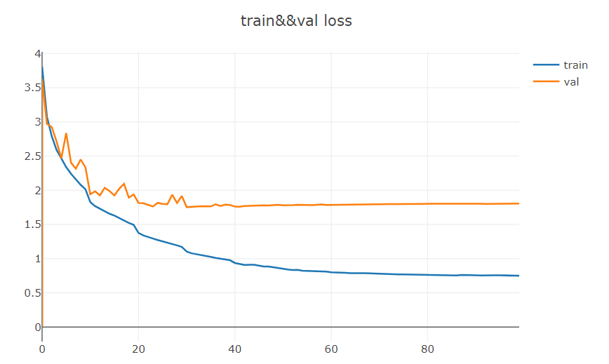
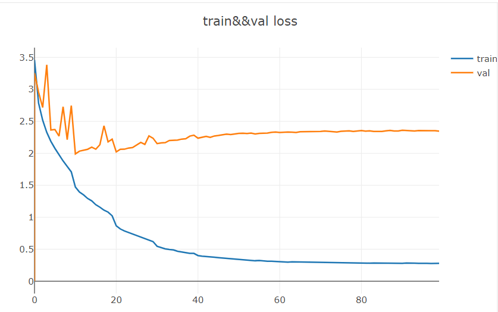
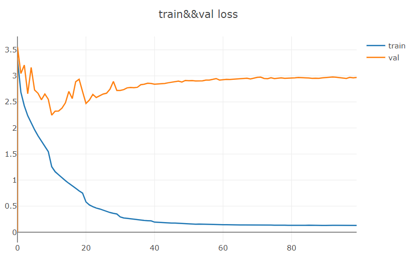

# Description
在这个项目中，我实现了CBAMBlock,并将其嵌入到Resnet网络框架中。与SEBlock相比，CBAMBlock改进了其通道注意力模块，融合平均池化和全局池化的特征。同时，其还引入了空间注意模块来增强感兴趣的特征，抑制噪声。与通道注意力模块一致，空间注意力模块融合了平均池化和全局池化的特征。
# Environment
python 3.7  
pytorch 1.5  
torchvision 0.6  
opencv 3.4
# Comprison
在这里，我使用了CIFAR100数据集分别训练了Resnet, SEResnet和CBAMResnet三个网络，并绘出了学习曲线来探讨三者的优缺点。  
  
  
  
从上面三幅图中可知：  
收敛速度：CBAMResnet > SEResnet > Resnet  
训练模型精度：CBAMResnet > SEResnet > Resnet  
但是三个模型都明显地出现了过拟合现象，模型中使用了dropout来避免这个现象但是效果并不明显。所以，接下来的工作是增加模型的限制或者是使用数据增强等方法来提高模型的泛化能力。

